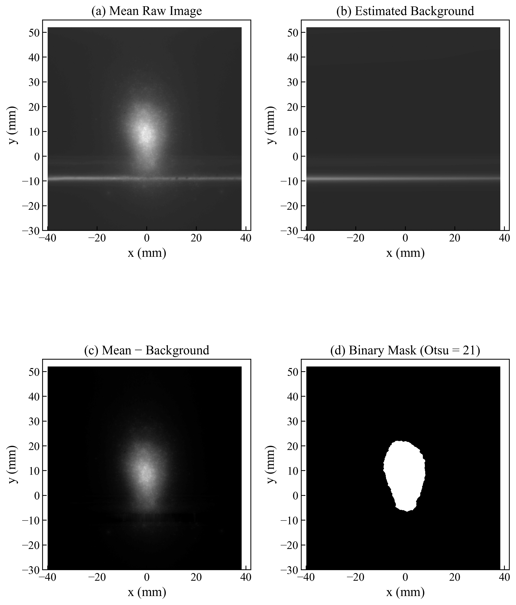
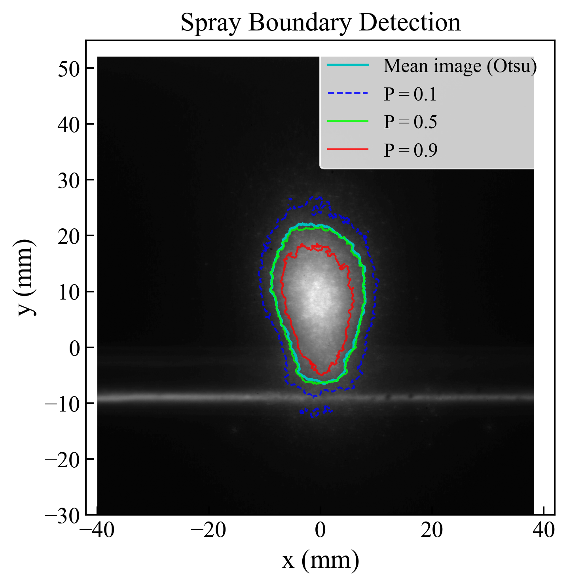

# Jet Spray Cross-Section Analysis

Python-based image processing for analyzing spray-occupied area, width, and height from cut-section (cross-sectional) Mie scattering images in jet in crossflow experiments.

## Description

This code performs comprehensive cross-sectional spray analysis:

**Methods:**
- Background estimation from spray-free edge regions
- Background subtraction and bar-region interpolation
- Otsu thresholding for spray boundary detection
- Per-frame instantaneous analysis
- Spray probability mapping

**Outputs:**
- Time-averaged spray metrics (area, width, height)
- Per-frame statistics with mean and standard deviation
- Multiple visualization plots (mean image, background, binary mask, probability map, etc.)
- CSV file with detailed results
- NPZ file for 3D reconstruction and further analysis

## Requirements

- Python 3.7+
- See `requirements.txt` for dependencies

## Installation

```bash
pip install -r requirements.txt
```

## Configuration

Edit parameters in `src/spray_cross_section_analysis.py`:

```python
# File paths
INPUT_DIR = Path(r"path/to/cropped/images")
OUTPUT_DIR = Path(r"path/to/output/results")

# Calibration & Nozzle position
PIXEL_TO_MM = 0.05996          # pixel calibration [mm/pixel]
X_ORIGIN_FROM_LEFT_MM = 39.932 # nozzle x-position [mm from left]
Y_ORIGIN_FROM_TOP_MM = 52.044  # nozzle y-position [mm from top]

# Output format
SAVE_FORMAT = "png"  # "png" or "pdf"
DPI = 300           # resolution for figures

# Coordinate system: nozzle exit at origin
# X: positive rightward, Y: positive upward
```

## Usage

1. **Prepare your data:**
   - Place cropped cut-section Mie scattering images in input directory
   - All images should be the same size and cropped consistently

2. **Update configuration** in `spray_cross_section_analysis.py`:
```python
   INPUT_DIR = Path(r"your/image/directory")
   OUTPUT_DIR = Path(r"your/output/directory")
   PIXEL_TO_MM = your_calibration_factor
   X_ORIGIN_FROM_LEFT_MM = nozzle_x_mm
   Y_ORIGIN_FROM_TOP_MM = nozzle_y_mm
```

3. **Run the analysis:**
```bash
   python src/spray_cross_section_analysis.py
```

## Outputs

### Figures (PNG/PDF)
- **fig_mean_image** - Mean Mie scattering image
- **fig_background_image** - Estimated background
- **fig_mean_subtracted** - Background-subtracted mean image
- **fig_processing_pipeline** - 4-panel processing steps
- **fig_spray_probability_map** - Spray presence probability (0-1)
- **fig_spray_boundary** - Detected boundaries with probability contours
- **fig_spray_dimensions** - Annotated area, width, height measurements
- **fig_width_profile** - Spray width as function of height
- **fig_area_timeseries** - Per-frame area variation
- **fig_width_height_timeseries** - Per-frame width and height
- **fig_instantaneous_boundaries** - 3 sample frames with boundaries

### Data Files
- **spray_results.csv** - Complete results table (time-averaged and per-frame)
- **section_data_otsu.npz** - Binary data for 3D reconstruction and analysis
  - Contour coordinates
  - Spray probability map
  - Binary mask
  - Coordinate grids
  - Spray metrics
  - Width profile
  - Per-frame statistics

## Coordinate System

**Origin:** Nozzle exit (fixed)
- **X** (rightward): positive away from nozzle
- **Y** (upward): positive away from bottom wall
- All coordinates in mm

## Algorithm

1. **Load all frames** and compute temporal mean
2. **Estimate background** from spray-free edge regions
3. **Subtract background** from mean image
4. **Interpolate** across spray bar band (over-subtraction fix)
5. **Apply Otsu threshold** for spray boundary detection
6. **Morphological processing** (close + open) to clean mask
7. **Per-frame analysis** for instantaneous statistics
8. **Probability mapping** across all frames

9. ## Example Results

Below are example outputs from the cross-section analysis:

### Processing Pipeline


*Left to right, top to bottom:*
- *(a) Mean Raw Mie Scattering Image* - temporal average of all frames
- *(b) Estimated Background* - synthesized from spray-free edge regions
- *(c) Mean - Background* - background-subtracted result
- *(d) Binary Mask (Otsu Threshold)* - spray boundary detection

### Spray Boundary Detection


*Detected spray boundaries with different probability contours:*
- **Cyan line** - Mean image binary contour (Otsu)
- **Blue dashed line** - Spray presence probability P = 0.1
- **Lime line** - Spray presence probability P = 0.5 (median)
- **Red line** - Spray presence probability P = 0.9 (high confidence)

---

## Author

[Abbas Zafar]

## Citation

If using this code in research, please cite:
